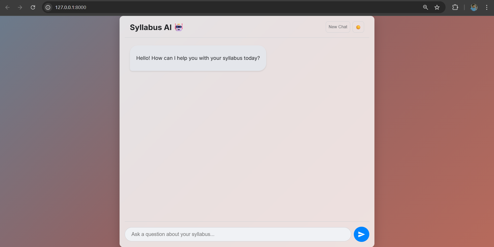
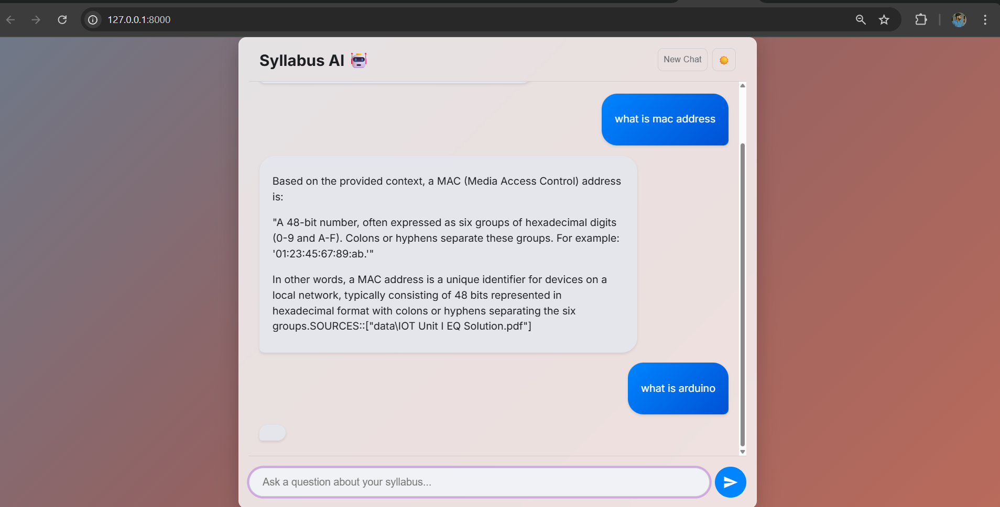
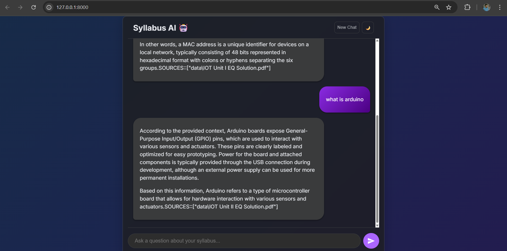
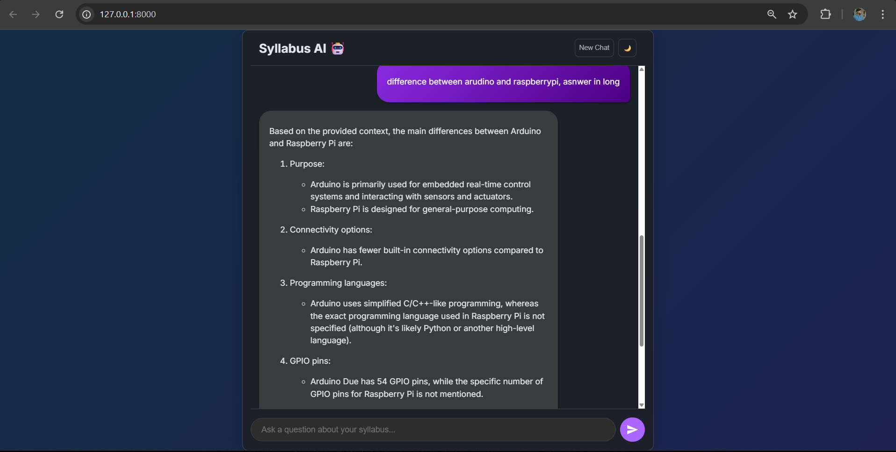

# Syllabus AI Chatbot 🤖

  

A powerful, locally-run chatbot designed to answer questions about your specific syllabus and course documents. This project uses a **Retrieval-Augmented Generation (RAG)** architecture to provide accurate, context-aware answers without needing an internet connection or paying for API fees.

-----
<p align="center">
  <a href="https://github.com/farhansayed16/Syllabus-chatbot/stargazers"></a>
  <a href="https://github.com/farhansayed16/Syllabus-chatbot/network/members"></a>
  <br>
  
  
  
  
  
</p>

-----
## ✨ Features

  * **Local & Private:** 100% free to run on your own machine. Your documents and conversations never leave your computer.
  * **Conversational Memory:** Remembers the context of your previous questions for natural, follow-up conversations.
  * **Source Verification:** Cites the source documents it used to generate an answer, so you can always verify the information.
  * **Dual Themes:** A beautiful, modern UI with polished light and dark themes. Your preference is saved automatically.
  * **Markdown & Code Rendering:** Correctly displays formatted text, lists, and code blocks with a one-click "Copy" button.
  * **Dynamic UI:** Features smooth animations, a real-time typing indicator, and an animated gradient background for a premium user experience.
  * **Easy Setup:** An automated script handles the entire setup process, from creating a virtual environment to installing dependencies.

-----

## 📸 Screenshots
## Light Theme  

  

## Light Theme with Sources 

  

## Dark Theme 

     

## Dark Theme with Code Block 



## 🛠️ Tech Stack

  * **Backend:** Python, FastAPI
  * **AI Orchestration:** LangChain
  * **LLM:** Ollama (running Llama 3 or other models)
  * **Vector Database:** ChromaDB
  * **Embeddings:** Sentence-Transformers
  * **Frontend:** HTML5, CSS3, Vanilla JavaScript
  * **Server:** Uvicorn

-----

## ✅ Prerequisites

Before you begin, ensure you have the following installed on your system:

  * [Python 3.10+](https://www.python.org/downloads/)
  * [Ollama](https://ollama.com/)

-----

## 🚀 Getting Started

Follow these steps to get your chatbot up and running.

### 1\. Clone the Repository

Open your terminal and clone this project:

```bash
git clone https://github.com/your-username/syllabus-chatbot.git
cd syllabus-chatbot
```

### 2\. Add Your Documents

Place all your syllabus documents (`.pdf`, `.docx`, etc.) inside the `data` folder. The chatbot will use these as its knowledge base.

### 3\. Ensure Ollama is Running

Start the Ollama application on your computer. You can confirm it's running by opening a new terminal and executing:

```bash
ollama list
```

This should show that the `llama3` model is available.

### 4\. Run the Setup Script

This project includes an automated script that will set up the virtual environment, install all required packages, and start the application.

**On Windows:**
Simply double-click the `setup_and_run.bat` file, or run it from the terminal:

```bash
.\setup_and_run.bat
```

**On macOS / Linux:**
First, make the script executable, then run it:

```bash
chmod +x setup_and_run.sh
./setup_and_run.sh
```

The first time you run this, it will perform the full setup and ingest your documents. On subsequent runs, it will skip the setup and directly start the server.

### 5\. Access the Chatbot

Once the server is running (you'll see a message from Uvicorn), open your web browser and navigate to:
[**http://127.0.0.1:8000**](http://127.0.0.1:8000)

You can now start chatting with your AI\!

-----

## 📂 Project Structure

```
syllabus-chatbot/
├── data/                 # Place your PDF/DOCX files here
├── db/                   # The vector database will be stored here
├── static/
│   ├── style.css         # All UI styling
│   └── script.js         # Frontend logic and interactivity
├── venv/                 # Virtual environment (created by script)
├── .gitignore
├── index.html            # The main HTML structure
├── ingest.py             # Script for processing and embedding documents
├── main.py               # The FastAPI backend server
├── README.md             # You are here!
├── requirements.txt      # List of Python dependencies
├── setup_and_run.bat     # Windows setup script
└── setup_and_run.sh      # macOS/Linux setup script
```

-----

## 📄 License

This project is licensed under the MIT License. See the `LICENSE` file for details.
